# Using Grafana dashboard

Prerequisite
- Kong metrics: http://localhost:8001/metrics
> Port:8001 Kong Admin API
- Prometheus: http://localhost:9090


## Docker
Grafana Docker image
Run the Grafana Docker container
Start the Docker container by binding Grafana to external port 3000.
```
docker run -d --name=grafana -p 3000:3000 grafana/grafana
```
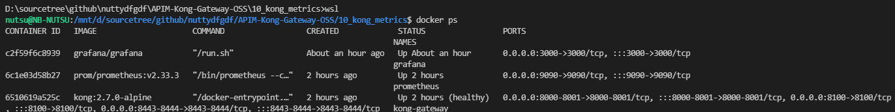

> Try it out, default admin user credentials are admin/admin.
> http://localhost:3000

Further documentation can be found at http://docs.grafana.org/installation/docker/.

https://grafana.com/docs/grafana-cloud/quickstart/docker-compose-linux/

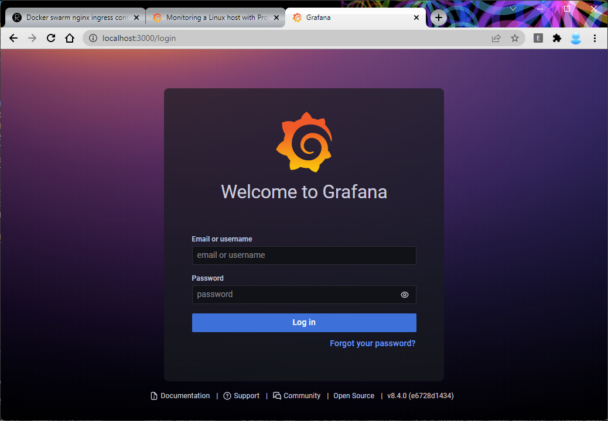

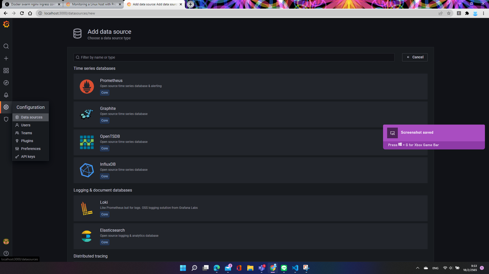

If you are using Prometheus in a docker container will not be accessible with localhost.
in this case we create grafana container outside 'kong-net' (specific in docker-compose.yml) network because default network is bridge. [link](https://docs.docker.com/network/)
```
docker network ls 
```
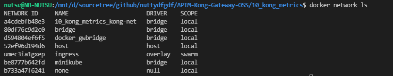

```
docker network connect <multi-host-network> <container>
docker network connect 10_kong_metrics_kong-net grafana
```

Show network detail
```
docker network inspect 10_kong_metrics_kong-net
```

Try nslookup command inside grafana container to kong-gateway and prometheus which is in the 'kong-net' network.
```
docker exec grafana nslookup kong-gateway
docker exec grafana nslookup prometheus
```

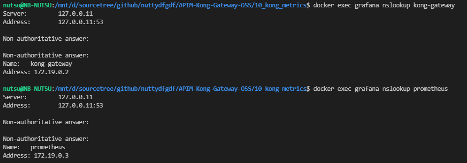

Go back to Grafana UI and add Data Sources/Prometheus.
At HTTP url enter the following values:

#HTTP
URL:http://prometheus:9090

click the 'Save & test' button at the bottom of the panel.

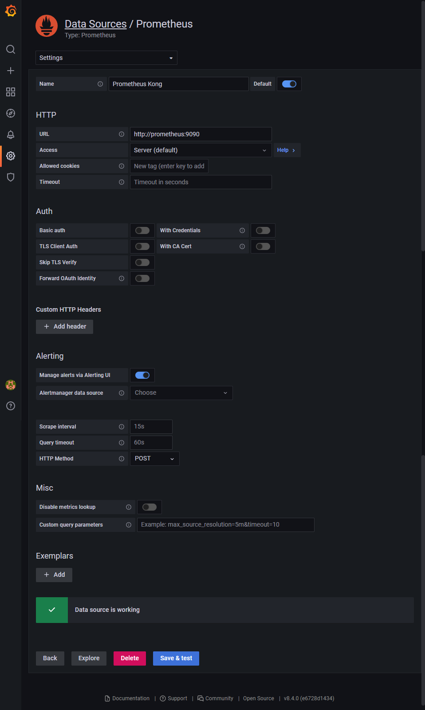

Now everything is fine. On the Explore menu, you'll see the metric name in the drop-down menu that pulls data from Prometheus.

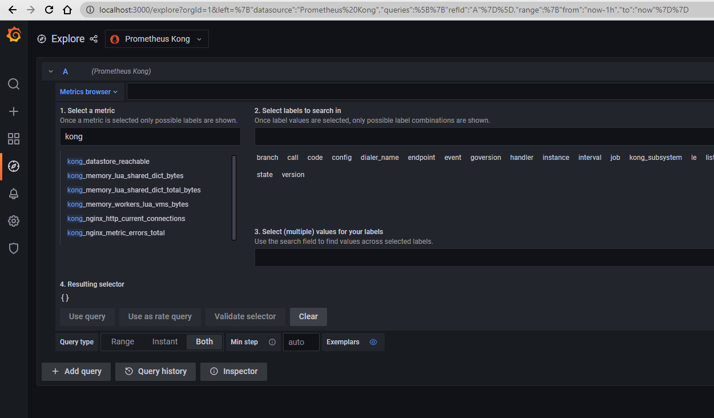

You can create grafana dashboards as you want. 
For convenience, in community grafana has provided the dashboard for Kong by Kong(Official) 
Please see the detail at https://grafana.com/grafana/dashboards/7424

You can get dashboard ID '7424' and import it into your Grafana.

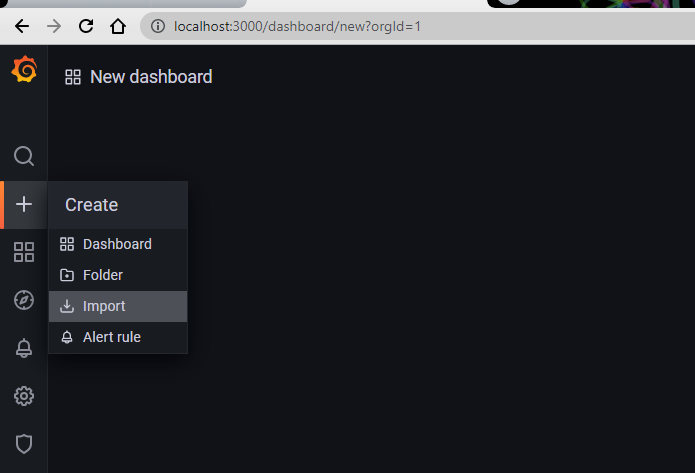

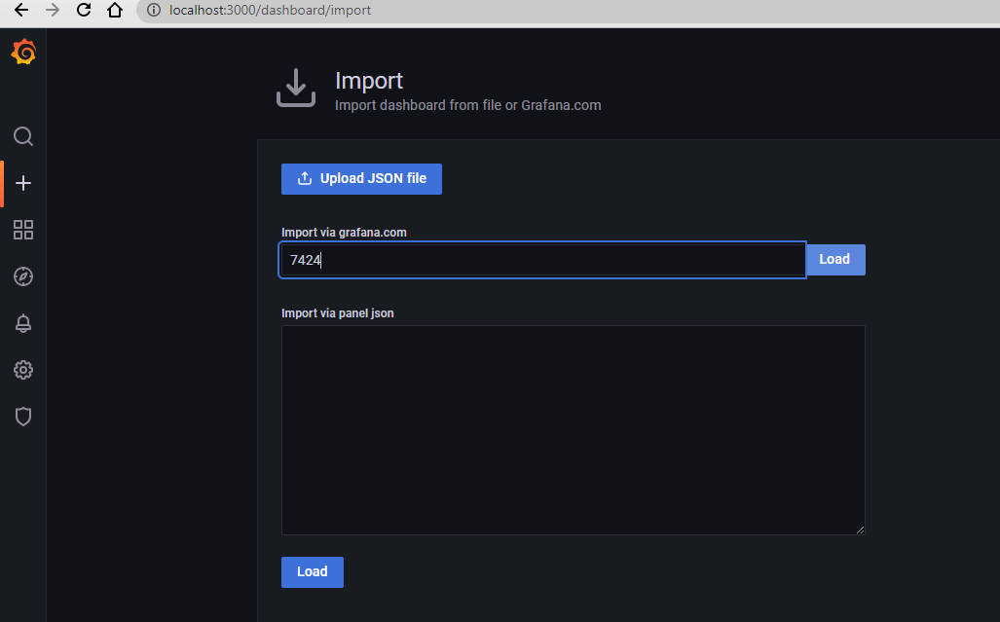

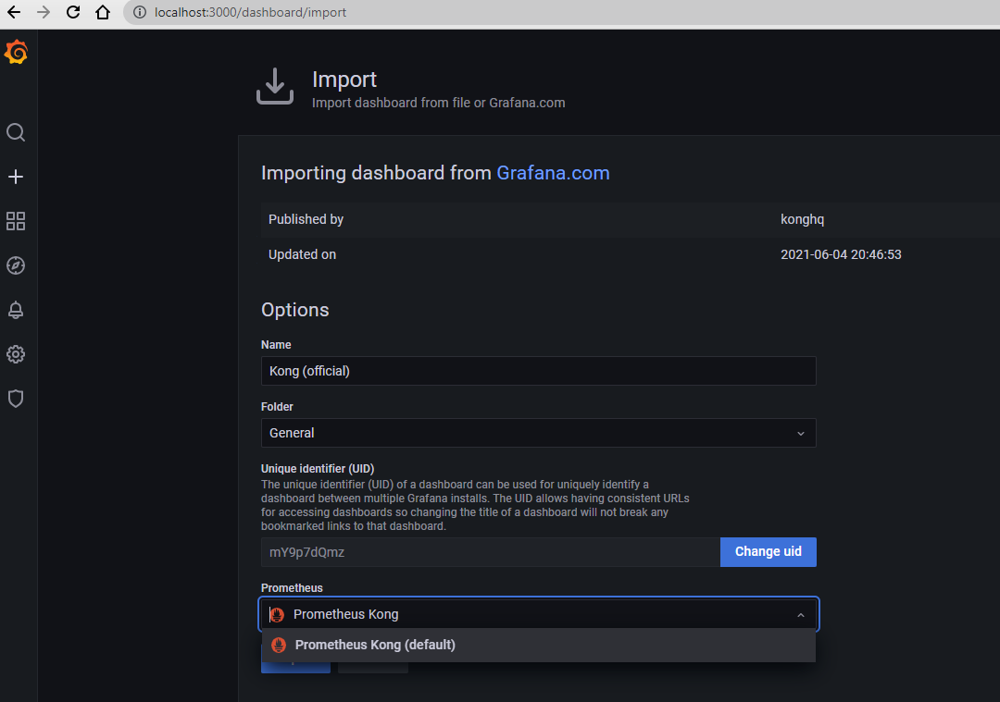

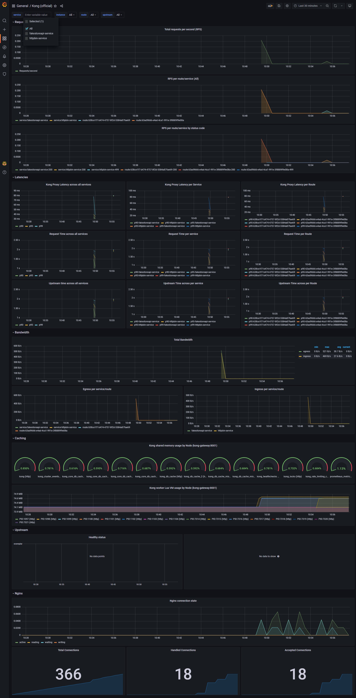


## Clean up
docker stop grafana
docker rm grafana
docker-compose down