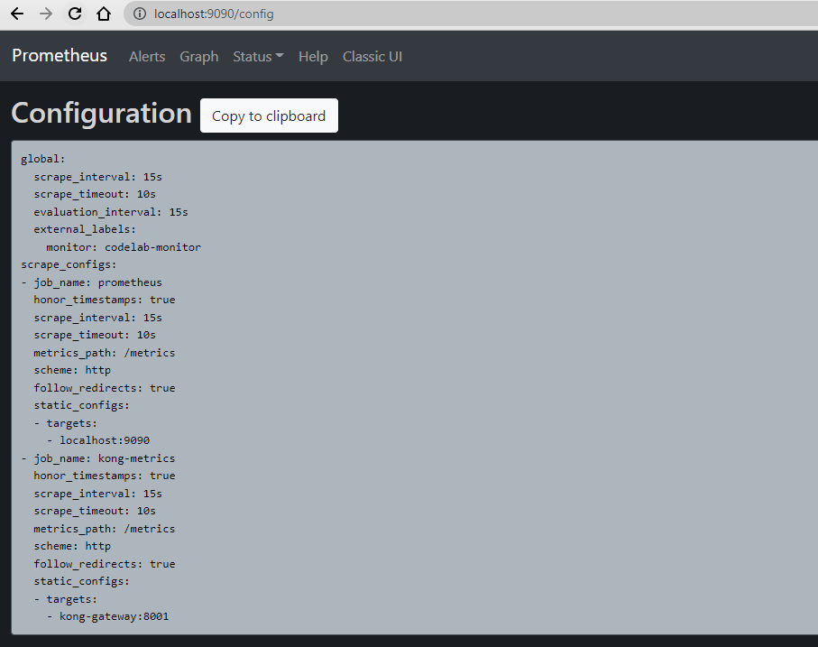
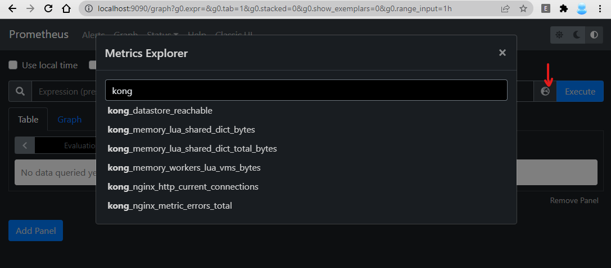
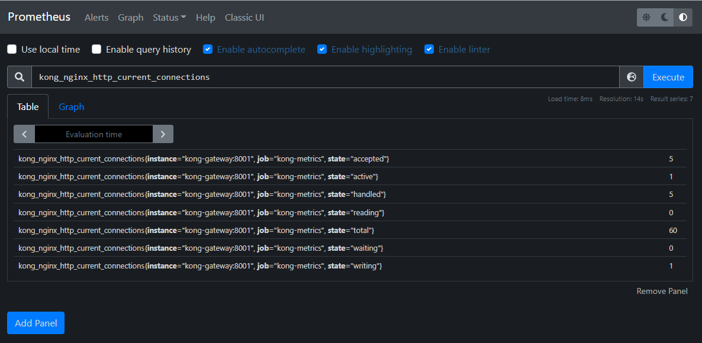
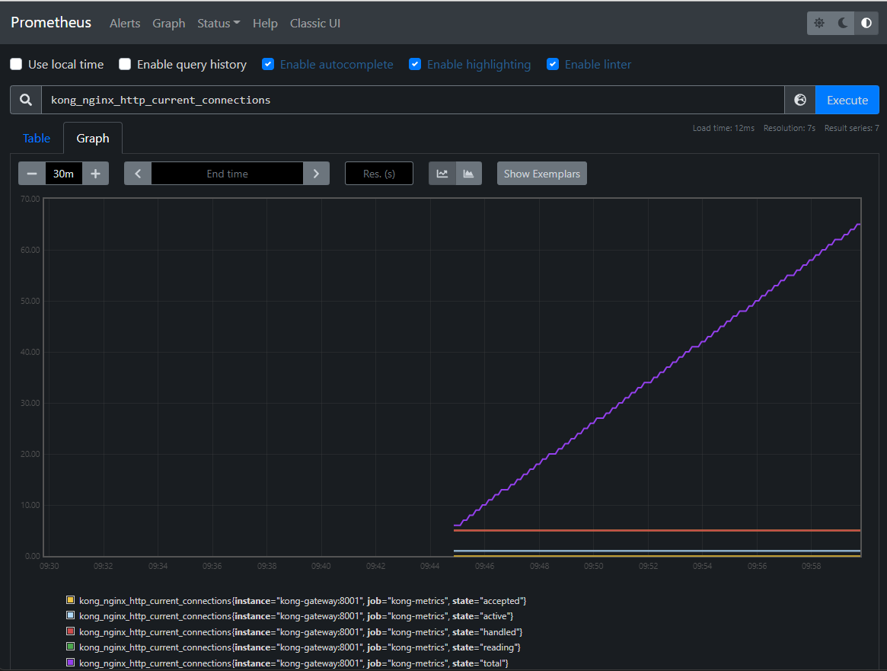

# Get Started
We will run Kong OSS using docker-compose. In this chapter, we'll show you how to quickly provision a kong with docker.

Go to the current directory and start the container with docker-compose
```
cd 01_kong_db_less
docker-compose up -d
```

View a list of containers
```
docker-compose ps
```
View logs of docker-compose
```
docker-compose logs
```

Get kong config via Kong Admin API
```
curl http://localhost:8001/config
```

Try testing the service on Kong Gateway using curl command.
```
curl http://localhost:8000/httpbin/anything
```

Try testing the service on Kong Admin using curl command.
```
curl http://localhost:8001
```

```
docker logs -f <container-name>
docker logs -f kong-gateway
```

Stop
```
docker-compose down
```

# Kong Prometheus 
https://docs.konghq.com/hub/kong-inc/prometheus/

Expose metrics related to Kong and proxied Upstream services in Prometheus exposition format, which can be scraped by a Prometheus Server.

## Enable the plugin globally
A plugin which is not associated to any service, route, or consumer is considered global, and will be run on every request. Read the Plugin Reference and the Plugin Precedence sections for more information.

For example, configure this plugin using the plugins: entry in the declarative configuration file:
Declarative (YAML) mode "kong_declarative_conf.yml"

```
plugins:
- name: prometheus
  service: {SERVICE}
  config:
    <optional_parameter>: <value>
```

## Grafana dashboard
Metrics exported by the plugin can be graphed in Grafana using a drop in dashboard: https://grafana.com/dashboards/7424.

### PermalinkAvailable metrics
-   Status codes: HTTP status codes returned by Upstream services. These are available per service, across all services, and per route per consumer.
-   Latencies Histograms: Latency as measured at Kong:
    -   Request: Total time taken by Kong and Upstream services to serve requests.
    -   Kong: Time taken for Kong to route a request and run all configured plugins.
    -   Upstream: Time taken by the Upstream service to respond to requests.
-   Bandwidth: Total Bandwidth (egress/ingress) flowing through Kong. This metric is available per service and as a sum across all services.
-   DB reachability: A gauge type with a value of 0 or 1, which represents whether DB can be reached by a Kong node.
-   Connections: Various Nginx connection metrics like active, reading, writing, and number of accepted connections.
-   Target Health: The healthiness status (healthchecks_off, healthy, unhealthy, or dns_error) of Targets belonging to a given Upstream as well as their subsystem (http or stream).
-   Dataplane Status: The last seen timestamp, config hash, config sync status and certificate expiration timestamp for data plane nodes is exported to control plane.
-   Enterprise License Information: The Kong Gateway license expiration date, features and license signature. Those metrics are only exported on Kong Gateway.
Here is an example of output you could expect from the /metrics endpoint:

Here is an example of output you could expect from the /metrics endpoint:
```
curl -i http://localhost:8001/metrics
HTTP/1.1 200 OK
Server: openresty/1.15.8.3
Date: Tue, 7 Jun 2020 16:35:40 GMT
Content-Type: text/plain; charset=UTF-8
Transfer-Encoding: chunked
Connection: keep-alive
Access-Control-Allow-Origin: *

# HELP kong_bandwidth Total bandwidth in bytes consumed per service/route in Kong
# TYPE kong_bandwidth counter
kong_bandwidth{type="egress",service="google",route="google.route-1"} 1277
kong_bandwidth{type="ingress",service="google",route="google.route-1"} 254
# HELP kong_datastore_reachable Datastore reachable from Kong, 0 is unreachable
# TYPE kong_datastore_reachable gauge
kong_datastore_reachable 1
# HELP kong_http_consumer_status HTTP status codes for customer per service/route in Kong
# TYPE kong_http_consumer_status counter
kong_http_consumer_status{service="s1",route="s1.route-1",code="200",consumer="<CONSUMER_USERNAME>"} 3
# HELP kong_http_status HTTP status codes per service/route in Kong
# TYPE kong_http_status counter
kong_http_status{code="301",service="google",route="google.route-1"} 2
# HELP kong_latency Latency added by Kong, total request time and upstream latency for each service in Kong
# TYPE kong_latency histogram
kong_latency_bucket{type="kong",service="google",route="google.route-1",le="00001.0"} 1
kong_latency_bucket{type="kong",service="google",route="google.route-1",le="00002.0"} 1
.
.
.
kong_latency_bucket{type="kong",service="google",route="google.route-1",le="+Inf"} 2
kong_latency_bucket{type="request",service="google",route="google.route-1",le="00300.0"} 1
kong_latency_bucket{type="request",service="google",route="google.route-1",le="00400.0"} 1
.
.
kong_latency_bucket{type="request",service="google",route="google.route-1",le="+Inf"} 2
kong_latency_bucket{type="upstream",service="google",route="google.route-1",le="00300.0"} 2
kong_latency_bucket{type="upstream",service="google",route="google.route-1",le="00400.0"} 2
.
.
kong_latency_bucket{type="upstream",service="google",route="google.route-1",le="+Inf"} 2
kong_latency_count{type="kong",service="google",route="google.route-1"} 2
kong_latency_count{type="request",service="google",route="google.route-1"} 2
kong_latency_count{type="upstream",service="google",route="google.route-1"} 2
kong_latency_sum{type="kong",service="google",route="google.route-1"} 2145
kong_latency_sum{type="request",service="google",route="google.route-1"} 2672
kong_latency_sum{type="upstream",service="google",route="google.route-1"} 527
# HELP kong_nginx_http_current_connections Number of HTTP connections
# TYPE kong_nginx_http_current_connections gauge
kong_nginx_http_current_connections{state="accepted"} 8
kong_nginx_http_current_connections{state="active"} 1
kong_nginx_http_current_connections{state="handled"} 8
kong_nginx_http_current_connections{state="reading"} 0
kong_nginx_http_current_connections{state="total"} 8
kong_nginx_http_current_connections{state="waiting"} 0
kong_nginx_http_current_connections{state="writing"} 1
# HELP kong_memory_lua_shared_dict_bytes Allocated slabs in bytes in a shared_dict
# TYPE kong_memory_lua_shared_dict_bytes gauge
kong_memory_lua_shared_dict_bytes{shared_dict="kong",kong_subsystem="http"} 40960
.
.
# HELP kong_memory_lua_shared_dict_total_bytes Total capacity in bytes of a shared_dict
# TYPE kong_memory_lua_shared_dict_total_bytes gauge
kong_memory_lua_shared_dict_total_bytes{shared_dict="kong",kong_subsystem="http"} 5242880
.
.
# HELP kong_memory_workers_lua_vms_bytes Allocated bytes in worker Lua VM
# TYPE kong_memory_workers_lua_vms_bytes gauge
kong_memory_workers_lua_vms_bytes{pid="7281",kong_subsystem="http"} 41124353
# HELP kong_data_plane_config_hash Config hash value of the data plane
# TYPE kong_data_plane_config_hash gauge
kong_data_plane_config_hash{node_id="d4e7584e-b2f2-415b-bb68-3b0936f1fde3",hostname="ubuntu-bionic",ip="127.0.0.1"} 1.7158931820287e+38
# HELP kong_data_plane_last_seen Last time data plane contacted control plane
# TYPE kong_data_plane_last_seen gauge
kong_data_plane_last_seen{node_id="d4e7584e-b2f2-415b-bb68-3b0936f1fde3",hostname="ubuntu-bionic",ip="127.0.0.1"} 1600190275
# HELP kong_data_plane_version_compatible Version compatible status of the data plane, 0 is incompatible
# TYPE kong_data_plane_version_compatible gauge
kong_data_plane_version_compatible{node_id="d4e7584e-b2f2-415b-bb68-3b0936f1fde3",hostname="ubuntu-bionic",ip="127.0.0.1",kong_version="2.4.1"} 1
# HELP kong_nginx_metric_errors_total Number of nginx-lua-prometheus errors
# TYPE kong_nginx_metric_errors_total counter
kong_nginx_metric_errors_total 0
# HELP kong_upstream_target_health Health status of targets of upstream. States = healthchecks_off|healthy|unhealthy|dns_error, value is 1 when state is populated.
kong_upstream_target_health{upstream="<upstream_name>",target="<target>",address="<ip>:<port>",state="healthchecks_off",subsystem="http"} 0
kong_upstream_target_health{upstream="<upstream_name>",target="<target>",address="<ip>:<port>",state="healthy",subsystem="http"} 1
kong_upstream_target_health{upstream="<upstream_name>",target="<target>",address="<ip>:<port>",state="unhealthy",subsystem="http"} 0
kong_upstream_target_health{upstream="<upstream_name>",target="<target>",address="<ip>:<port>",state="dns_error",subsystem="http"} 0

```

# Prometheus

http://localhost:9090/

Verify that the configuration is correct.
http://localhost:9090/config



Verify that the Docker target is listed at http://localhost:9090/targets/.


Go to prometheus graph
http://localhost:9090/graph







## Prometheus Container
docker exec -it prometheus sh
cat /etc/prometheus/prometheus.yml

