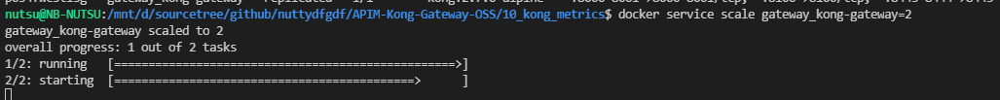
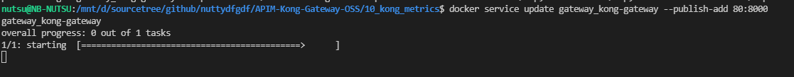
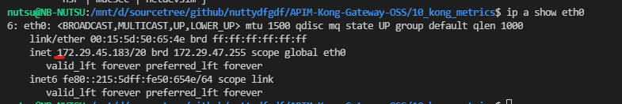
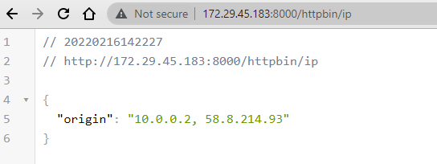
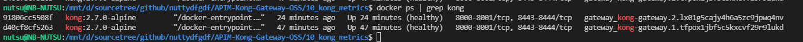
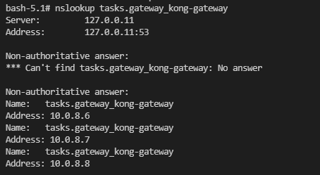
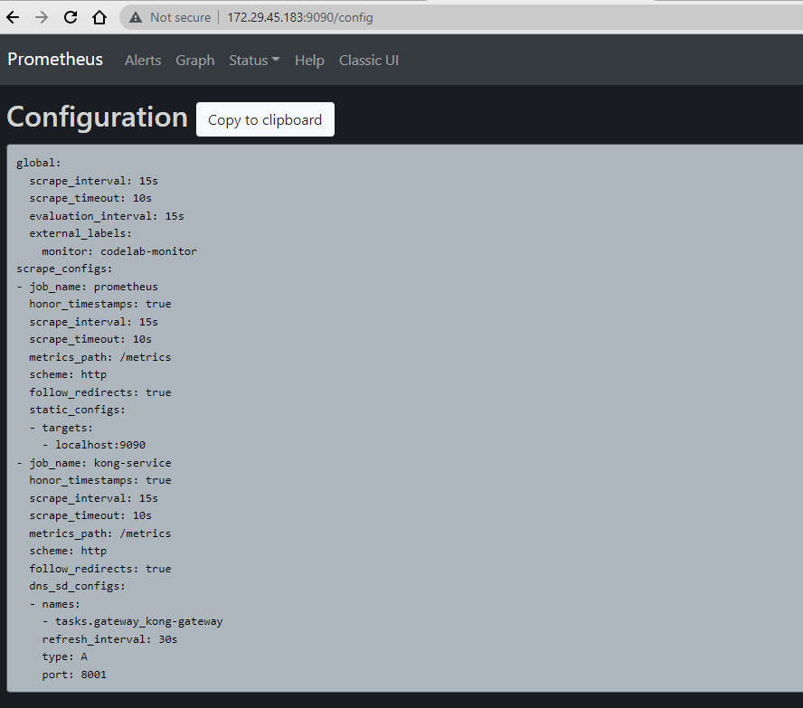
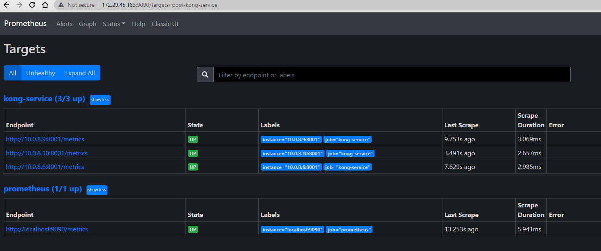

# Deploy a stack to a swarm
Deploy the stack to the swarm

we need to create an overlay network first. This network will then be attached to our backends. Create the network with:
```
docker network create --driver overlay ingress-routing
```

Create the stack with docker stack deploy:
```
docker stack deploy --compose-file docker-compose-stack.yml gateway
docker stack deploy -c <(docker-compose config) kong
```

Check that it’s running with docker stack services stackdemo:
```
docker stack ls
docker stack services gateway
docker stack ps gateway
docker service ls
docker service logs -f gateway_kong-gateway
docker service logs gateway_kong-gateway
docker service logs -f --tail=100 gateway_kong-gateway
```

Run the following command to change the desired state of the service running in the swarm:
```
docker service scale <SERVICE-ID>=<NUMBER-OF-TASKS>
```
For example:
```
docker service scale helloworld=5
docker service scale gateway_kong-gateway=3
docker service scale gateway_kong-gateway=5
```



Run docker service ps <SERVICE-ID> to see the updated task list:
```
docker service ps helloworld
docker service ps gateway_kong-gateway
```


Test it out (on localhost) it works
```
curl http://localhost:8000/httpbin/ip
```
Output
```
{
  "origin": "10.0.0.2, 58.8.214.93"
}
```

You can publish ports by updating the service.
```
docker service update <your-service> --publish-add 80:8000
docker service update gateway_kong-gateway --publish-add 80:8000
docker service update gateway_kong-gateway --publish-rm 80:8000
```
Note:
--publish-add		Add or update a published port
--publish-rm		Remove a published port by its target port




Also, you could use the below command to verify your LISTEN ports:
```
netstat -tulpn
```

> but if you use wsl2 on window you can access the service with eth0 
At the WSL terminal try 'ip a show eth0' and look for eth0 ip




and other command to check network object.
```
docker service inspect gateway_kong-gateway
docker network ls
docker network inspect ingress-routing
```

https://garutilorenzo.github.io/nginx-ingress-controller/


Bring the stack down with docker stack rm:
```
docker stack rm gateway
docker network rm ingress-routing
```

### Scraping a Docker Swarm service with Prometheus
https://www.innoq.com/en/blog/scraping-docker-swarm-service-instances-with-prometheus/

As my Docker swarm only consists of a single manager node (my local machine), I can see the running Docker containers of all three replicas
```
docker ps | grep kong
```


To see the DNS service discovery at work I connect to one of the containers running inside the Docker swarm. I have to install the dnsutils package to be able to use nslookup.
```
docker exec -it <container-id> bash
docker exec -u 0 -it 4af4f23d1649 bash //Connect into container with root user
# Install dnsutils
whoami
apk update && apk install dnsutils -y
```

```
nslookup gateway_kong-gateway
```

To resolve the virtual IP addresses of all service replicas running in my Docker swarm I have to lookup the tasks.<service name> domain name (see Docker overlay network documentation)
```
nslookup tasks.gateway_kong-gateway
```



Next step Scraping the service instances within the swarm
The interesting part of the configuration file is the swarm-service scrape job I added. I use a dns_sd_config ([see documentation for details](https://prometheus.io/docs/prometheus/latest/configuration/configuration/#dns_sd_config )) to lookup the scrape targets by executing a DNS query. I need to execute a type A DNS query and as the query only returns the IP addresses of the service instance I have to tell Prometheus the port the instances are listening on along with the path to the metrics endpoint.
```yaml
scrape_configs:
  ...
  - job_name: 'kong-service'
    dns_sd_configs:
      - names:
          - 'tasks.gateway_kong-gateway'
        type: 'A'
        port: 8001
    metrics_path: '/metrics'
```

> Verify the configuration in prometheus has been changed.
http://xxxxx:9090/config

To send a SIGHUP, first determine the process id of Prometheus. This may be in a file such as /var/run/prometheus.pid, or you can use tools such as pgrep to find it. Then use the kill command to send the signal:

Alternatively, you can send a HTTP POST to the Prometheus web server:
```
curl -X POST http://localhost:9090/-/reload
```
docker container ps | grep prometheus
docker container restart <container-id>
52e460420120

Result






Clean
```
docker stack rm gateway
docker network rm ingress-routing
```


# Kubernetes
Create ConfigMaps from files
You can use kubectl create configmap to create a ConfigMap from an individual file, or from multiple files.
```yaml
kubectl create configmap kong-declarative-config --from-file=./kong-configuration/kong_declarative_conf.yml
# would produce the following ConfigMap:
kubectl describe configmaps kong-declarative-config
kubectl get configmaps kong-declarative-config -o yaml
```

