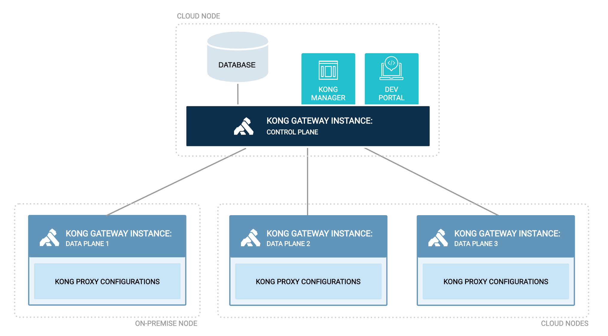

# Kong Hybrid control plane & data plane



## Prerequisite 
### Generate a certificate/key pair
Create exec from image container
```bash
docker run --rm -it kong/kong-gateway:2.8.0.0-alpine bash
cd /home/kong
kong hybrid gen_cert
```

```bash
Successfully generated certificate/key pairs, they have been written to: '/home/kong/cluster.crt' and '/home/kong/cluster.key'.
bash-5.1$ ls -la
total 20
drwxr-sr-x    1 kong     nogroup       4096 Jul 15 10:40 .
drwxr-xr-x    1 root     root          4096 Mar  2 04:19 ..
-rw-r--r--    1 kong     nogroup        526 Jul 15 10:40 cluster.crt
-rw-------    1 kong     nogroup        306 Jul 15 10:40 cluster.key
```

open another terminal session
```bash
//docker cp <containerId>:/home/kong/cluster.crt ${PWD}/cert/cluster.crt

docker cp 5dbb4ba0d8d5:/home/kong/cluster.crt ${PWD}/cert/cluster.crt
docker cp 5dbb4ba0d8d5:/home/kong/cluster.key ${PWD}/cert/cluster.key
```
Exit second terminal

## Option 1 : Docker Run 

### Create docker network
```bash
cd 12_kong_cp_dp

docker network create kong-net
```

### Set up database
Start a PostgreSQL container:
```bash
 docker run -d --name kong-database \
  --network=kong-net \
  -p 5432:5432 \
  -e "POSTGRES_USER=kong" \
  -e "POSTGRES_DB=kong" \
  -e "POSTGRES_PASSWORD=kongpass" \
  postgres:9.6
```

Prepare the Kong database:
```bash
docker run --rm --network=kong-net \
  -e "KONG_DATABASE=postgres" \
  -e "KONG_PG_HOST=kong-database" \
  -e "KONG_PG_PASSWORD=kongpass" \
  -e "KONG_PASSWORD=test" \
 kong/kong-gateway:2.8.0.0-alpine kong migrations bootstrap
```

### Set up the control plane
```bash
docker run --rm -d --name kong-cp \
  --network=kong-net \
  -v "$(pwd)/kong-configuration/kong_declarative_conf.yml:/usr/local/kong/declarative/kong.yml" \
  -v "$(pwd)/cert:/home/kong/cert" \
  -e "KONG_DATABASE=postgres" \
  -e "KONG_PG_HOST=kong-database" \
  -e "KONG_PG_USER=kong" \
  -e "KONG_PG_PASSWORD=kongpass" \
  -e "KONG_PROXY_ACCESS_LOG=/dev/stdout" \
  -e "KONG_ADMIN_ACCESS_LOG=/dev/stdout" \
  -e "KONG_PROXY_ERROR_LOG=/dev/stderr" \
  -e "KONG_ADMIN_ERROR_LOG=/dev/stderr" \
  -e "KONG_ADMIN_LISTEN=0.0.0.0:8001" \
  -e "KONG_ADMIN_GUI_URL=http://localhost:8002" \
  -e "KONG_ROLE=control_plane" \
  -e "KONG_CLUSTER_CERT=/home/kong/cert/cluster.crt" \
  -e "KONG_CLUSTER_CERT_KEY=/home/kong/cert/cluster.key" \
  -p 8000:8000 \
  -p 8443:8443 \
  -p 8001:8001 \
  -p 8444:8444 \
  -p 8002:8002 \
  -p 8445:8445 \
  -p 8003:8003 \
  -p 8004:8004 \
  -p 8005:8005 \
  -p 8006:8006 \
  kong/kong-gateway:2.8.0.0-alpine

docker logs kong-cp
```

```bash
docker run --rm -d --name kong-dp --network=kong-net \
 -e "KONG_ROLE=data_plane" \
 -e "KONG_DATABASE=off" \
 -e "KONG_PROXY_LISTEN=0.0.0.0:8080" \
 -e "KONG_CLUSTER_CONTROL_PLANE=kong-cp:8005" \
 -e "KONG_CLUSTER_TELEMETRY_ENDPOINT=kong-cp:8006" \
 -e "KONG_CLUSTER_CERT=/home/kong/cert/cluster.crt" \
 -e "KONG_CLUSTER_CERT_KEY=/home/kong/cert/cluster.key" \
 --mount type=bind,source="$(pwd)"/cert,target=/home/kong/cert,readonly \
 -p 8080:8080 \
 kong/kong-gateway:2.8.0.0-alpine

docker logs kong-dp

curl http://localhost:8080
```


## Option 2 : Docker Compose 
```bash
cd 12_kong_cp_dp
docker-compose up -d
docker-compose ps
docker-compose logs
```
## Verify that nodes are connected
curl -i -X GET http://<admin-hostname>:8001/clustering/data-planes
```
curl -i -X GET http://localhost:8001/clustering/data-planes
```

## Try to Configuring a Service
Set environment variable
```bash
# ADMIN_ENDPOINT=http://localhost:8001
# PROXY_ENDPOINT=http://localhost:8080
ADMIN_ENDPOINT=http://localhost:8001
PROXY_ENDPOINT=http://localhost:8080
```

1. Add a Service using the Admin API
```bash
curl -i -X POST \
  --url ${ADMIN_ENDPOINT}/services/ \
  --data 'name=httpbin-service' \
  --data 'url=https://httpbin.org'
```

2. Add a Route for the Service
```bash
curl -i -X POST \
  --url ${ADMIN_ENDPOINT}/services/httpbin-service/routes \
     -d "name=httpbin-route" \
     -d "hosts[]=local.httpbin.com" \
     -d "paths[]=/httpbin"
```

3. Forward your requests through Kong
```bash
curl -i -X GET \
  --url ${PROXY_ENDPOINT}/httpbin/anything \
  --header 'Host: local.httpbin.com'
```

## Plugin configuration
### Prometheus Enable globally
```bash
curl -X POST ${ADMIN_ENDPOINT}/plugins/ \
  --data "name=prometheus"
```

Metrics tracked by this plugin are available on both the Admin API and Status 
API at the http://localhost:<port>/metrics

```bash
curl ${ADMIN_ENDPOINT}/metrics
```


# Deploy a stack to a swarm
Deploy the stack to the swarm

we need to create an overlay network first. This network will then be attached to our backends. Create the network with:
```
docker network create --driver overlay ingress-routing
```

Create the stack with docker stack deploy:
```
docker stack deploy --compose-file docker-compose.yml kong-gateway
```
